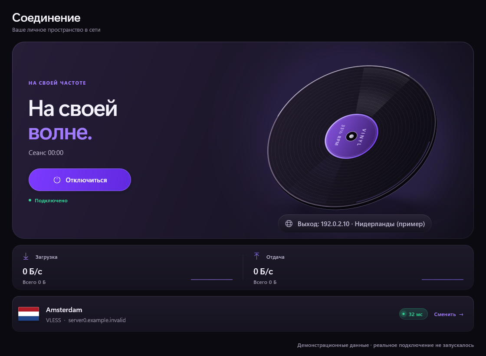

# Vinyl для Windows

Портативный VPN-клиент на sing-box. Скачал архив, распаковал, запустил `vinyl.exe` — всё.
Настройки, логи и список серверов лежат рядом с exe, в систему ничего не размазывается.

Здесь только готовые архивы, описания выпусков и контрольные суммы. Исходники ведутся отдельно.

Аккаунта Vinyl нет и не будет. Подписка или ключ нужны свои — свой сервер или тот, что
дал провайдер; в комплект они не входят.




## Что умеет

- VLESS (в том числе Reality и XTLS Vision), VMess, Trojan, Shadowsocks, Hysteria2, TUIC, WireGuard
- Подписки: обновляются сами, показывают остаток трафика и дату окончания, если панель их отдаёт
- Разделение по программам: все, только выбранные или все кроме выбранных
- Два режима для сайтов: всё через VPN со списком исключений или наоборот — напрямую, а в туннель только список
- Готовые наборы для рунета: банки с госуслугами, российские сайты
- Автовыбор сервера: ядро само меряет задержку через туннель и держит живой
- Экран «Трафик»: что куда идёт прямо сейчас, через VPN или мимо
- Блокировка при обрыве через фильтры Windows
- Смена сервера и подключение прямо из трея
- Перенос настроек на другой компьютер одним файлом

Работать умеет двумя способами. Туннель забирает весь трафик системы и просит права
администратора — но только в момент подключения, не при запуске. Системный прокси обходится
вообще без прав, зато ловит лишь те программы, которые ходят через настройки прокси Windows.

## Скачать

Архивы — в разделе [Releases](https://github.com/claustrophobDev/Vinyl-Releases/releases).

| Ваша Windows | Архив |
|---|---|
| x64, Intel или AMD | `Vinyl-<версия>.zip` |
| ARM64 | `Vinyl-<версия>-arm64.zip`, если он приложен к выпуску |

На ARM-машине берите именно ARM-архив. Обычный x64 там запустится через эмуляцию, и окно
вы увидите, а вот туннель не поднимется: драйверу сетевого адаптера эмуляция не помогает,
ему нужна своя архитектура.

Нужна Windows 10 или 11. Всё, что тут выложено, проверялось на одиннадцатой; на десятке
часть украшений окна (скруглённые углы, тёмная рамка заголовка) просто не применится —
на работу это не влияет.

## Запустить

Распакуйте **всю папку**, не только exe — рядом лежат ядро, драйвер и списки, без них
программа не подключится. Дальше вкладка «Серверы», кнопка «Вставить из буфера»,
и подключение с главного экрана.

Настройки и логи — в папке `data` рядом с программой. Переносите её вместе с остальным
или выгрузите настройки файлом прямо из приложения, на вкладке «Настройки».

Внутри архива:

```
vinyl.exe
uninstall.exe
Как пользоваться.txt
LICENSE.txt
THIRD-PARTY-NOTICES.md
core\      ядро sing-box и драйвер адаптера
geo\       списки российских сайтов и подсетей
data\      сюда лягут настройки и логи
licenses\  лицензии чужих компонентов
```

## Проверить, что скачалось

К каждому выпуску приложен `SHA256SUMS.txt`. Сверьте:

```powershell
Get-FileHash -Algorithm SHA256 .\Vinyl-<версия>.zip
```

`vinyl.exe` и `uninstall.exe` подписаны, но сертификат самоподписанный. На вашем
компьютере Windows его не знает, поэтому в свойствах файла подпись будет с ошибкой,
а SmartScreen при первом запуске покажет предупреждение. Это ожидаемо и ничего не
доказывает в обе стороны — сверяйте хеш, он надёжнее. Защиту Windows ради запуска
отключать не надо.

Ядро `sing-box.exe` внутри архива идёт таким, каким его выпускают авторы проекта,
своей подписи мы на него не ставим.

## Обновления

Программа сама смотрит выпуски этого репозитория — без токена и без аккаунта. Если
вышла версия новее и к ней приложен архив под вашу архитектуру, она предложит открыть
страницу выпуска. Файлы вы меняете руками: распаковываете новый архив и переносите
в него свою папку `data`.

## Убрать

`uninstall.exe` рядом с программой убирает ярлык из меню пуск и строчку из «Программ и
компонентов» — только это в системе и было. Дальше удалите папку целиком.

## Честно про блокировку при обрыве

Блокировка держится на динамических фильтрах Windows Filtering Platform. Пока Vinyl
работает, наружу мимо туннеля никто не ходит; loopback и само ядро не трогаем. Если
Vinyl закрыть или прибить, фильтры снимет сама система — интернет к вам вернётся,
но и защиты в этот момент уже нет. Это защита во время работы, а не после падения.

Утечки IPv4, IPv6 и DNS пока не проверены захватом трафика на стенде. Пока такой
проверки нет, обещать полное отсутствие утечек было бы враньём.
